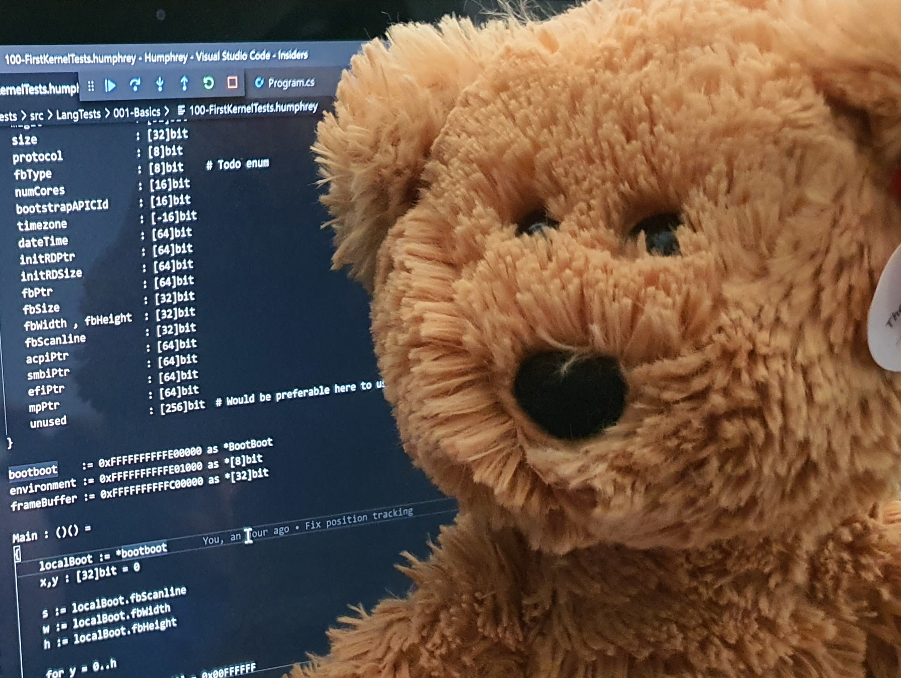

Humphrey is a work in progress compiler and language. Humphrey is also a bear (see image above for examples of both).

# Humphrey the language

Humphrey borrows some ideas from the [Emulation Description Language](http://savourysnax.github.io/EDL/), but is being designed to be a general purpose language. 

# Humphrey the bear (the languages namesake)

Late 2017, christmas day to be precise, I suffered a haemorrhagic stroke. This resulted in me spending christmas through new years in hospital. I had an operation to block up the aneurysm, and shortly after the operation I was greeted by the bear pictured above. Humphrey was bought for me by my distraught partner, who had a significantly worse christmas/new years than myself, and who is directly responsible for me still being alive today. 
